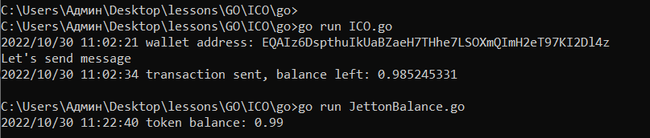

## Вступление
## Что такое ICO
ICO — Initial Coin Offering (первичное размещение токенов) — выпуск каким-либо проектом или компанией своих денег — токенов (криптовалюты) с целью привлечения инвестиций.

### Зачем нужно ICO
Проведение ICO проектом, позволяет обеспечить его финансированием, что нужно для разработки, развития и масштабирования. Обычно проводя ICO предполагается, что токены будут стоить больше со временем. Отмечу, что "порядочные" проекты, в своих роудмапах закладывают различные механики, не позволяющие цене токена резко упасть, спровоцировав еще более резкое падение цены далее. 

Если вам любопытно понять насколько прибыльные бывают ICO, то статистику по ROI ICO проектов, можно посмотреть [здесь](https://icodrops.com/ico-stats/).

> Отфильтруйте по USD ROI чтобы увидеть топ проекты.

### Важно: Риски

Говоря про ICO нельзя обойти стороной риски, по факту, покупая токены, вы покупаете записи в блокчейне, ценность, которых обеспечивается только проектом эмитентом токенов. С технической стороны, смарт-контракт с помощью которого проводят ICO может быть взломан или изначально иметь заложенный бэкдор, который позволит владельцу смарт-контракта поменять условия ICO, ну и конечно же любой проект может соскамиться, даже если изначально цели создавать скам не было.

## Обзор смарт-контрактов

В данном уроке мы будем использовать смарт-контракт из примеров, которые приведены в стандарте Jetton, а именно мастер-контракт `jetton-minter-ICO.fc` [отсюда](https://github.com/ton-blockchain/token-contract/tree/main/ft).

Существенным различием между мастер-контрактом из девятого урока, который мы разбирали подробно, является наличие в данном смарт-контракте ICO механики, за счет следующего кода в `recv_internal()`:

	if (in_msg_body.slice_empty?()) { ;; buy jettons for Toncoin

		  int amount = 10000000; ;; for mint message
		  int buy_amount = msg_value - amount;
		  throw_unless(76, buy_amount > 0);

		  int jetton_amount = buy_amount; ;; rate 1 jetton = 1 toncoin; multiply to price here

		  var master_msg = begin_cell()
				.store_uint(op::internal_transfer(), 32)
				.store_uint(0, 64) ;; quert_id
				.store_coins(jetton_amount)
				.store_slice(my_address()) ;; from_address
				.store_slice(sender_address) ;; response_address
				.store_coins(0) ;; no forward_amount
				.store_uint(0, 1) ;; forward_payload in this slice, not separate cell
				.end_cell();

		  mint_tokens(sender_address, jetton_wallet_code, amount, master_msg);
		  save_data(total_supply + jetton_amount, admin_address, content, jetton_wallet_code);
		  return ();
		}

Как вы может видеть, обмен  Toncoin на токены происходит при отправке сообщения с пустым телом. Соответственно, в этом уроке мы сделаем следующее:
- сделаем два кошелька: с одного запустим мастер-контракт, со второго отправим сообщение с пустым телом для получения токенов
- задеплоим  `jetton-minter-ICO.fc`
- отправим со второго кошелька сообщение с пустым телом и некоторым кол-во Toncoin для обмена на токены
- проверим, что баланс токенов поменялся

## Деплоим контракты для ICO в тестовую сеть 

> Если вы проходили прошлые уроки и хорошо их помните, перелистывайте сразу до Деплоим контракты

### Кошельки

Первое, что надо сделать, это создать два кошелька в TON w1 и w2, один из них будет "адресом администратора" смарт-контракта, второй мы будем использовать для обмена тестовых TON на Jetton в тестовой сети.(урок, где разбирается как это сделать [здесь](https://github.com/romanovichim/TonFunClessons_ru/blob/main/14lesson/wallet.md))

Код `SeedPhrase.go`: 

	package main

	import (
		"context"
		"log"
		"fmt"

		"github.com/xssnick/tonutils-go/liteclient"
		"github.com/xssnick/tonutils-go/ton"
		"github.com/xssnick/tonutils-go/ton/wallet"
	)

	func main() {

		client := liteclient.NewConnectionPool()

		configUrl := "https://ton-blockchain.github.io/testnet-global.config.json"

		err := client.AddConnectionsFromConfigUrl(context.Background(), configUrl)
		if err != nil {
			panic(err)
		}
		api := ton.NewAPIClient(client)

		seed1 := wallet.NewSeed()
		fmt.Println("Seed phrase one:")
		fmt.Println(seed1)

		w1, err := wallet.FromSeed(api, seed1, wallet.V3)
		if err != nil {
			log.Fatalln("FromSeed err:", err.Error())
			return
		}
		fmt.Println("Address one:")
		fmt.Println(w1.Address())

		seed2 := wallet.NewSeed()
		fmt.Println("Seed phrase two:")
		fmt.Println(seed2)

		w2, err := wallet.FromSeed(api, seed2, wallet.V3)
		if err != nil {
			log.Fatalln("FromSeed err:", err.Error())
			return
		}
		fmt.Println("Address two:")
		fmt.Println(w2.Address())

		block, err := api.CurrentMasterchainInfo(context.Background())
		if err != nil {
			log.Fatalln("CurrentMasterchainInfo err:", err.Error())
			return
		}

		balance1, err := w1.GetBalance(context.Background(), block)
		if err != nil {
			log.Fatalln("GetBalance err:", err.Error())
			return
		}
		fmt.Println("Balance one:")
		fmt.Println(balance1)

		balance2, err := w2.GetBalance(context.Background(), block)
		if err != nil {
			log.Fatalln("GetBalance err:", err.Error())
			return
		}
		fmt.Println("Balance two:")
		fmt.Println(balance2)

	}

Сохраняем куда-нибудь себе сид фразы, с помощью них мы будем пользоваться кошельком в других скриптах, а также отправляем тестовые тонкойны на оба адреса с помощью бота: https://t.me/testgiver_ton_bot

Минутой позже, проверим, что средства поступили с помощью:  https://testnet.tonscan.org/

> Так как кошелька два предется подождать некоторое время, чтобы пополнить второй кошелек.

Пользоваться кошельками мы будем с помощью написанных нами функций, как и в прошлых уроках. Воспользуемся ими чтобы, например, узнать баланс.

Код `WalletFunC.go`: 

	package main

	import (
		"context"
		"log"
		"fmt"
		"strings"

		"github.com/xssnick/tonutils-go/liteclient"
		"github.com/xssnick/tonutils-go/ton"
		"github.com/xssnick/tonutils-go/ton/wallet"
	)

	func main() {

		client := liteclient.NewConnectionPool()

		configUrl := "https://ton-blockchain.github.io/testnet-global.config.json"

		err := client.AddConnectionsFromConfigUrl(context.Background(), configUrl)
		if err != nil {
			panic(err)
		}
		api := ton.NewAPIClient(client)

		w1 := getWallet1(api)
		w2 := getWallet2(api)

		fmt.Println(w1.Address())
		fmt.Println(w1.Address())
		block, err := api.CurrentMasterchainInfo(context.Background())
		if err != nil {
			log.Fatalln("CurrentMasterchainInfo err:", err.Error())
			return
		}

		balance1, err := w1.GetBalance(context.Background(), block)
		if err != nil {
			log.Fatalln("GetBalance1 err:", err.Error())
			return
		}

		fmt.Println(balance1)

		balance2, err := w2.GetBalance(context.Background(), block)
		if err != nil {
			log.Fatalln("GetBalance2 err:", err.Error())
			return
		}

		fmt.Println(balance2)

	}

	func getWallet1(api *ton.APIClient) *wallet.Wallet {
		words := strings.Split("your Seed phrase 1", " ")
		w, err := wallet.FromSeed(api, words, wallet.V3)
		if err != nil {
			panic(err)
		}
		return w
	}

	func getWallet2(api *ton.APIClient) *wallet.Wallet {
		words := strings.Split("your Seed phrase 2", " ")
		w, err := wallet.FromSeed(api, words, wallet.V3)
		if err != nil {
			panic(err)
		}
		return w
	}

> Да, можно сделать одну функцию и прокидывать туда параметры, но сделано так для простоты восприятия кода

### Деплоим контракты

#### Создаем hexBoc представление контрактов

В библиотеке `tonutils-go` можно деплоить смарт-контракт в форме hexBoc. Boc это сериализованная форма смарт-контракта(bag-of-cells). Чтобы перевести смарт-контракт в форму hexBoc из func, нужно сначала скомпилировать его в fift, а потом отдельным fift скриптом получить hexBoc. Сделать это можно с помощью уже хорошо знакомого нам `toncli`. Но обо всем попорядку.

##### Собираем код jetton-minter-ICO и jetton-wallet

Код на func возьмем из [примеров](https://github.com/ton-blockchain/token-contract/tree/main/ft), нам нужны `jetton-minter-ICO.fc` и `jetton-minter.fc`, а также вспомогательные:
- `jetton-utils.fc`
- `op-codes.fc`
- `params.fc`

> Для вашего удобства я собрал два кода амальгамы(все в одном файле), смотрите в code файлы: `code-amalgama.func` и `codewallet-amalgama.func`

##### Получаем fift

Код на func превращаем в fift c помощью `toncli func build`

> В code полученный файлы это `contract` и `contractwallet`

##### Напечатаем hexBoc

Теперь скрипт, который переведет код в формат hexBOC:

	#!/usr/bin/fift -s
	"TonUtil.fif" include
	"Asm.fif" include

	."first contract:" cr

	"first.fif" include
	2 boc+>B dup Bx. cr cr

Подробно останавливаться на fift не будет, это выходит, за рамки этого урока, отмечу только:
- boc+>B - сериализует в формат boc
- cr - выводит в строку значение

> Запустить скрипт можно либо с помощью знакомого нам toncli, а именно `toncli fift run` , либо как описано [здесь](https://ton.org/docs/#/compile?id=fift).

Пример скрипта, находится в файле `print-hex.fif`.

Итог:
 - `jetton-minter-ICO.fc` hexBoc:  B5EE9C7241020B010001F5000114FF00F4A413F4BCF2C80B0102016202030202CD040502037A60090A03F7D00E8698180B8D8492F81F07D201876A2687D007D206A6A1812E38047221AC1044C4B4028B350906100797026381041080BC6A28CE4658FE59F917D017C14678B13678B10FD0165806493081B2044780382502189E428027D012C678B666664F6AA701B02698FE99FC00AA9185D718141083DEECBEF09DD71812F83C0607080093F7C142201B82A1009AA0A01E428027D012C678B00E78B666491646580897A007A00658064907C80383A6465816503E5FFE4E83BC00C646582AC678B28027D0109E5B589666664B8FD80400606C215131C705F2E04902FA40FA00D43020D08060D721FA00302710345042F007A05023C85004FA0258CF16CCCCC9ED5400FC01FA00FA40F82854120970542013541403C85004FA0258CF1601CF16CCC922C8CB0112F400F400CB00C9F9007074C8CB02CA07CBFFC9D05006C705F2E04A13A1034145C85004FA0258CF16CCCCC9ED5401FA403020D70B01C3008E1F8210D53276DB708010C8CB055003CF1622FA0212CB6ACB1FCB3FC98042FB00915BE20008840FF2F0007DADBCF6A2687D007D206A6A183618FC1400B82A1009AA0A01E428027D012C678B00E78B666491646580897A007A00658064FC80383A6465816503E5FFE4E840001FAF16F6A2687D007D206A6A183FAA9040CA85A166 
 - `jetton-minter.fc` hexBoc:  B5EE9C7241021201000330000114FF00F4A413F4BCF2C80B0102016202030202CC0405001BA0F605DA89A1F401F481F481A8610201D40607020148080900BB0831C02497C138007434C0C05C6C2544D7C0FC02F83E903E900C7E800C5C75C87E800C7E800C00B4C7E08403E29FA954882EA54C4D167C0238208405E3514654882EA58C511100FC02780D60841657C1EF2EA4D67C02B817C12103FCBC2000113E910C1C2EBCB853600201200A0B020120101101F100F4CFFE803E90087C007B51343E803E903E90350C144DA8548AB1C17CB8B04A30BFFCB8B0950D109C150804D50500F214013E809633C58073C5B33248B232C044BD003D0032C032483E401C1D3232C0B281F2FFF274013E903D010C7E800835D270803CB8B11DE0063232C1540233C59C3E8085F2DAC4F3200C03F73B51343E803E903E90350C0234CFFE80145468017E903E9014D6F1C1551CDB5C150804D50500F214013E809633C58073C5B33248B232C044BD003D0032C0327E401C1D3232C0B281F2FFF274140371C1472C7CB8B0C2BE80146A2860822625A020822625A004AD822860822625A028062849F8C3C975C2C070C008E00D0E0F00AE8210178D4519C8CB1F19CB3F5007FA0222CF165006CF1625FA025003CF16C95005CC2391729171E25008A813A08208989680AA008208989680A0A014BCF2E2C504C98040FB001023C85004FA0258CF1601CF16CCC9ED5400705279A018A182107362D09CC8CB1F5230CB3F58FA025007CF165007CF16C9718010C8CB0524CF165006FA0215CB6A14CCC971FB0010241023000E10491038375F040076C200B08E218210D53276DB708010C8CB055008CF165004FA0216CB6A12CB1F12CB3FC972FB0093356C21E203C85004FA0258CF1601CF16CCC9ED5400DB3B51343E803E903E90350C01F4CFFE803E900C145468549271C17CB8B049F0BFFCB8B0A0822625A02A8005A805AF3CB8B0E0841EF765F7B232C7C572CFD400FE8088B3C58073C5B25C60063232C14933C59C3E80B2DAB33260103EC01004F214013E809633C58073C5B3327B55200083200835C87B51343E803E903E90350C0134C7E08405E3514654882EA0841EF765F784EE84AC7CB8B174CFCC7E800C04E81408F214013E809633C58073C5B3327B55209FB23AB6
 
#### Подготавливаем данные для Jetton
 
Для деплоя помимо hexBoc нам нужны данные для storage контракта jetton-minter-ICO. Посмотрим по стандарту какие данные нужны:

	;; storage scheme
	;; storage#_ total_supply:Coins admin_address:MsgAddress content:^Cell jetton_wallet_code:^Cell = Storage;
	

Для удобства посмотрим на функцию сохраняющую данные в регистр `с4`:

	 () save_data(int total_supply, slice admin_address, cell content, cell jetton_wallet_code) impure inline {
	  set_data(begin_cell()
				.store_coins(total_supply)
				.store_slice(admin_address)
				.store_ref(content)
				.store_ref(jetton_wallet_code)
			   .end_cell()
			  );
	}

Content по стандарту можно посмотреть [здесь](https://github.com/ton-blockchain/TIPs/issues/64). Так как это тестовый пример собирать все данные не будем, положим только ссылку и то на уроки))
 
	 func getContractData(OwnerAddr *address.Address) *cell.Cell {
		// storage scheme
		// storage#_ total_supply:Coins admin_address:MsgAddress content:^Cell jetton_wallet_code:^Cell = Storage;

		uri := "https://github.com/romanovichim/TonFunClessons_ru"
		jettonContentCell := cell.BeginCell().MustStoreStringSnake(uri).EndCell()

		contentRef := cell.BeginCell().
			MustStoreRef(jettonContentCell).
			EndCell()

		return data
	}
 
После подготовки ссылки соберем ячейку данных, положив туда:
 - общее предложение токенов MustStoreUInt(10000000, 64)
 - адрес кошелька админа MustStoreAddr(OwnerAddr)
 - ячейка с контентом jettonContentCell
 - код кошелька контракта MustStoreRef(getJettonWalletCode())
 
	func getContractData(OwnerAddr *address.Address) *cell.Cell {
		// storage scheme
		// storage#_ total_supply:Coins admin_address:MsgAddress content:^Cell jetton_wallet_code:^Cell = Storage;

		uri := "https://github.com/romanovichim/TonFunClessons_ru"
		jettonContentCell := cell.BeginCell().MustStoreStringSnake(uri).EndCell()

		contentRef := cell.BeginCell().
			MustStoreRef(jettonContentCell).
			EndCell()

		data := cell.BeginCell().MustStoreUInt(10000000, 64).
			MustStoreAddr(OwnerAddr).
			MustStoreRef(contentRef).
			MustStoreRef(getJettonWalletCode()).
			EndCell()

		return data
	}

#### Осуществляем деплой 

 В целом скрипт деплоя идентичен скрипту из урока, где мы деплоили NFT коллекцию. У нас есть функция `getContractData` с данными, две функции с hexboc мастер контракта и кошелька и main откуда мы деплоим ICO контракт:
 
	 func main() {

		// connect to mainnet lite server
		client := liteclient.NewConnectionPool()

		configUrl := "https://ton-blockchain.github.io/testnet-global.config.json"

		err := client.AddConnectionsFromConfigUrl(context.Background(), configUrl)
		if err != nil {
			panic(err)
		}
		api := ton.NewAPIClient(client)
		w := getWallet(api)

		msgBody := cell.BeginCell().EndCell()

		fmt.Println("Deploying Jetton ICO	contract to mainnet...")
		addr, err := w.DeployContract(context.Background(), tlb.MustFromTON("0.02"),
			msgBody, getJettonMasterCode(), getContractData(w.Address()), true)
		if err != nil {
			panic(err)
		}

		fmt.Println("Deployed contract addr:", addr.String())
	}
 
Пример скрипта в файле `DeployJettonMinter.go`. 
 
### Вызываем смарт-контракты

После деплоя смарт-контракта, остается вызвать его и обменять Toncoin, на наш токен. Для этого надо отправить сообщение с пустым телом и каким-то кол-вом Toncoin. Воспользуемся вторым кошельком, который мы заготовили в начале урока.

Код `ICO.go`:

	func main() {
		client := liteclient.NewConnectionPool()
		// connect to testnet lite server
		err := client.AddConnectionsFromConfigUrl(context.Background(), "https://ton-blockchain.github.io/testnet-global.config.json")
		if err != nil {
			panic(err)
		}

		// initialize ton api lite connection wrapper
		api := ton.NewAPIClient(client)

		// seed words of account, you can generate them with any wallet or using wallet.NewSeed() method
		words := strings.Split("your seed phrase", " ")

		w, err := wallet.FromSeed(api, words, wallet.V3)
		if err != nil {
			log.Fatalln("FromSeed err:", err.Error())
			return
		}

		log.Println("wallet address:", w.Address())

		block, err := api.CurrentMasterchainInfo(context.Background())
		if err != nil {
			log.Fatalln("CurrentMasterchainInfo err:", err.Error())
			return
		}

		balance, err := w.GetBalance(context.Background(), block)
		if err != nil {
			log.Fatalln("GetBalance err:", err.Error())
			return
		}

		if balance.NanoTON().Uint64() >= 100000000 {

			// ICO address 
			addr := address.MustParseAddr("EQD_yyEbNQeWbWfnOIowqNilB8wwbCg6nLxHDP3Rbey1eA72")

		fmt.Println("Let's send message")
		err = w.Send(context.Background(), &wallet.Message{
		 Mode: 3,
		 InternalMessage: &tlb.InternalMessage{
		  IHRDisabled: true,
		  Bounce:      true,
		  DstAddr:     addr,
		  Amount:      tlb.MustFromTON("1"),
		  Body:        cell.BeginCell().EndCell(),
		 },
		}, true)
		if err != nil {
		 fmt.Println(err)
		}

			// update chain info
			block, err = api.CurrentMasterchainInfo(context.Background())
			if err != nil {
				log.Fatalln("CurrentMasterchainInfo err:", err.Error())
				return
			}

			balance, err = w.GetBalance(context.Background(), block)
			if err != nil {
				log.Fatalln("GetBalance err:", err.Error())
				return
			}

			log.Println("transaction sent, balance left:", balance.TON())

			return
		}

		log.Println("not enough balance:", balance.TON())
	}
	

В случае успеха в https://testnet.tonscan.org/ можем увидеть следущую картину: 

Наше сообщение и обраное сообщение уведомление.

### Изучаем результат

 Возьмем баланс токенов с нашего кошелька с которого мы отправляли Toncoin.
 
 Код `JettonBalance.go`:

	package main

	import (
		"context"
		"github.com/xssnick/tonutils-go/address"
		_ "github.com/xssnick/tonutils-go/tlb"
		"github.com/xssnick/tonutils-go/ton/jetton"
		_ "github.com/xssnick/tonutils-go/ton/nft"
		_ "github.com/xssnick/tonutils-go/ton/wallet"
		"log"
		_ "strings"

		"github.com/xssnick/tonutils-go/liteclient"
		"github.com/xssnick/tonutils-go/ton"
	)

	func main() {
		client := liteclient.NewConnectionPool()

		// connect to testnet lite server
		err := client.AddConnectionsFromConfigUrl(context.Background(), "https://ton-blockchain.github.io/testnet-global.config.json")
		if err != nil {
			panic(err)
		}

		// initialize ton api lite connection wrapper
		api := ton.NewAPIClient(client)

		// jetton contract address
		contract := address.MustParseAddr("EQD_yyEbNQeWbWfnOIowqNilB8wwbCg6nLxHDP3Rbey1eA72")
		master := jetton.NewJettonMasterClient(api, contract)

		// get jetton wallet for account
		ownerAddr := address.MustParseAddr("EQAIz6DspthuIkUaBZaeH7THhe7LSOXmQImH2eT97KI2Dl4z")
		tokenWallet, err := master.GetJettonWallet(context.Background(), ownerAddr)
		if err != nil {
			log.Fatal(err)
		}

		tokenBalance, err := tokenWallet.GetBalance(context.Background())
		if err != nil {
			log.Fatal(err)
		}

		log.Println("token balance:", tokenBalance.String())
	}

В случае успеха можем увидеть следущую картину: 

>  Токенов меньше чем мы отправили Toncoin так как есть комиссии, плюс контракту нужно отправить сообщение обратно.

##  Задание

В библиотеке tonutils-go, есть отельные удобные методы для передачи токенов с кошелька на кошелек, попробуйте воспользоваться ими для передачи токенов с кошелька `w2` на `w1`.

## Заключениe

Токены открывают много возможностей, но также и содержат в себе сопоставимые риски.