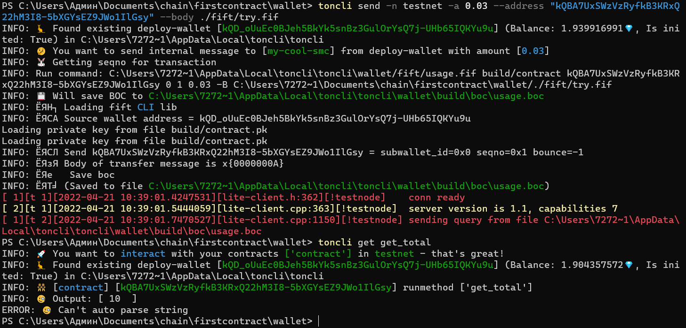

# Урок 1 Простой смарт-контракт
## Введение

В этом уроке мы напишем ваш первый смартконтракт в тестовой сети The Open Network на языке FUNC, задеплоим* его в тестовую сеть с помощью [toncli](https://github.com/disintar/toncli), а также протестируем его с помощью сообщения на языке Fift.

  > *Деплой  - процесс переноса в сеть (в данном случае смарт-контракта в блокчейн)
  
## Требования

Для прохождения данного урока вам необходимо установить интерфейс для командной строки [toncli](https://github.com/disintar/toncli/blob/master/INSTALLATION.md)

## Смарт-контракт

Смарт-контракт, который мы будем делать, должен обладать следующей функциональностью:
- хранить в своих данных целое число *total* - 64-битное число без знака;
- при получении внутреннего входящего сообщения контракт, должен взять 32-битное целое число без знака из тела сообщения, добавить его к *total* и сохранить в данных контракта;
- В смарт-контракте должен быть предусмотрен метод *get total* позволяющий вернуть значение *total* 
- Если тело входящего сообщения меньше 32 бит, то контракт должен выдать исключение

## Создадим проект с помощью toncli

В консоли выполните следующие команды:

    toncli start wallet
    cd wallet

Toncli создал простой проект кошелька, в нем вы можете увидеть 4 папки:
- build;
- func;
- fift;
- test;

На данном этапе нас интересуют папки func и fift, в которых мы будем писать код на FunС и Fift соответственно.

##### Что такое FunC и Fift

Высокоуровневый язык FunC используется для программирования смарт-контрактов на TON. Программы FunC компилируются в Fift ассемблерный код, который генерирует соответствующий байт-код для виртуальной машины TON (TVM) (Подробнее про TVM [здесь](https://ton-blockchain.github.io/docs/tvm.pdf)). Далее этот байт-код (на самом деле дерево ячеек, как и любые другие данные в TON Blockchain) может быть использован для создания смарт-контракта в блокчейне или может быть запущен на локальном экземпляре TVM (TON Virtual Machine).

Подробнее с FunC можно ознакомиться [здесь](https://ton.org/docs/#/smart-contracts/)

##### Подготовим файл для нашего кода

Зайдите в папку func:

    cd func

И откройте файл code.func, на своем экране вы увидите смарт-контракт кошелька, удалите весь код и мы готовы начать писать наш первый смарт контракт.

## Внешние методы

У смарт-контрактов в сети TON есть два внешних метода к которым можно обращаться.

Первый, `recv_external()` эта функция выполняется когда запрос к контракту происходит из внешнего мира, то есть не из TON, например когда мы сами формируем сообщение и отправляем его через lite-client (Про установку [lite-client](https://ton.org/docs/#/compile?id=lite-client)).
 Второй, `recv_internal()` эта функция выполняется когда внутри самого TON, например когда какой-либо контракт обращается к нашему.
 
Под наши условия подходит `recv_internal()`

В файле `code.fc` пропишем:

    () recv_internal(slice in_msg_body) impure {
    ;; здесь будет код
    }
 
 >  ;;  две точки с запятой синтаксис однострочного комментария
 
Мы передаем в функцию слайс in_msg_body и используем ключевое слово impure

`impure` — ключевое слово, которое указывает на то, что функция изменяет данные смарт-контракта.

Например, мы должны указать `impure` спецификатор, если функция может изменять хранилище контрактов, отправлять сообщения или генерировать исключение, когда некоторые данные недействительны и функция предназначена для проверки этих данных.

Важно: Если не указано impure и результат вызова функции не используется, то компилятор FunC может удалить этот вызов функции.

А вот чтобы понять, что такое слайс, поговорим про типы в смарт-контрактах сети TON

##### Типы cell, slice, builder, integrer в FunC

В нашем просто смарт контракте мы будем использовать всего лишь четыре типа:

- Cell(ячейка) - Ячейка TVM, состоящая из 1023 бит данных и до 4 ссылки на другие ячейки
- Slice(слайс)- Частичное представление ячейки TVM, используемой для разбора данных из ячейки
- Builder - Частично построенная ячейка, содержащая до 1023 бит данных и до четырех ссылок; может использоваться для создания новых ячеек
- Integrer - знаковое 257-разрядное целое число

Подробнее о типах в FunC:
[кратко здесь](https://ton.org/docs/#/smart-contracts/)
[развернуто здесь в разделе 2.1](https://ton-blockchain.github.io/docs/fiftbase.pdf)

Говоря простым языком, что cell - это запечатанная ячейка, slice - это когда ячейку можно читать, а builder - это когда собираешь ячейку.

## Преобразуем полученный слайс в Integer

Чтобы преобразовать полученный слайс в Integer  добавим следуюший код:
`int n = in_msg_body~load_uint(32);` 

Функция `recv_internal()` теперь выглядит так:

    () recv_internal(slice in_msg_body) impure {
    int n = in_msg_body~load_uint(32);
    }

`load_uint` функция из [стандартной библиотеки FunC ](https://ton.org/docs/#/func/stdlib) она загружает целое число n-бит без знака из слайса.

## Постоянные данные смарт-контракта

Чтобы добавить полученную переменную к `total` и сохранить значение в смарт-контракте, рассмотрим как реализован функционал хранения постоянных данных/хранилища в TON.

> Примечание: не путайте с TON Storage, хранилище в предыдущем предложении удобная аналогия.

Виртуальная машина TVM является стековой, соответственно хорошей практикой хранения данных в контракте будет использовать определенный регистр, а не хранить данный "сверху" стека.

Для хранения постоянных данных отведен регистр с4, тип данных Cell.

Подробнее с регистрами можно ознакомиться [с4](https://ton-blockchain.github.io/docs/tvm.pdf)  в пункте 1.3

##### Возьмем данные из с4

Для того чтобы "достать" данные из с4 нам понадобятся две функции из [стандартной библиотеки FunC ](https://ton.org/docs/#/func/stdlib) .

А именно:
`get_data`   - берет ячейку из c4 регистра.
`begin_parse` -   ячейку преобразует в slice 

Передадим это значение в слайс ds

`slice ds = get_data().begin_parse();` 

А также преобразуем этот слайс в Integer 64-бит для суммирования в соответствии с нашей задачей. (С помощью уже знакомой нам функции `load_uint`)

`int total = ds~load_uint(64);` 

Теперь наша функция будет выглядеть так:

    () recv_internal(slice in_msg_body) impure {
		int n = in_msg_body~load_uint(32);

		slice ds = get_data().begin_parse();
		int total = ds~load_uint(64);
    }

##### Cуммируем

Для суммирования будем использовать бинарную операцию суммирования `+`  и присвоение `=` 

    () recv_internal(slice in_msg_body) impure {
		int n = in_msg_body~load_uint(32);

		slice ds = get_data().begin_parse();
		int total = ds~load_uint(64);

		total += n;
    }

##### Cохраняем значение

Для того чтобы сохранить постоянное значение, нам необходимо выполнить три действия:

- создать Builder для будущей ячейки
- записать в нее значение
- из Builder создать Cell (ячейку)
- Записать получившуюся ячейку в регистр

Делать это мы будем опять же с помощью функций [стандартной библиотеки FunC ](https://ton.org/docs/#/func/stdlib)

`set_data(begin_cell().store_uint(total, 64).end_cell());` 

`begin_cell()` - создаст Builder для будущей ячейки
`store_uint()`- запишет значение total
`end_cell()`- создать Cell (ячейку)
`set_data()` - запишет ячейку в регистр с4

Итог:

    () recv_internal(slice in_msg_body) impure {
		int n = in_msg_body~load_uint(32);

		slice ds = get_data().begin_parse();
		int total = ds~load_uint(64);

		total += n;

		set_data(begin_cell().store_uint(total, 64).end_cell());
    }

## Генерация исключений

Все что осталось сделать в нашей internal функции это добавить вызов исключения, если полученна переменная не 32-битная.

Для этого будем использовать [встроенные](https://ton.org/docs/#/func/builtins) исключения. 

Исключения могут быть вызваны условными примитивами `throw_if` и `throw_unless` и безусловным `throw` .

Воспользуемся `throw_if` и передадим любой код ошибки. Для того, чтобы взять битность используем `slice_bits()`.

	throw_if(35,in_msg_body.slice_bits() < 32);
	
Кстати в виртуальной машине TON TVM, есть стандартные коды исключений, они нам очень понадобятся в тестах. Посмотреть можно [здесь](https://ton.org/docs/#/smart-contracts/tvm_exit_codes).

Вставим в начало функции:

    () recv_internal(slice in_msg_body) impure {
		throw_if(35,in_msg_body.slice_bits() < 32);

		int n = in_msg_body~load_uint(32);

		slice ds = get_data().begin_parse();
		int total = ds~load_uint(64);

		total += n;

		set_data(begin_cell().store_uint(total, 64).end_cell());
    }

## Пишем Get функцию

Любая функция в FunC  соответствует следующему паттерну:

`[<forall declarator>] <return_type><function_name(<comma_separated_function_args>) <specifiers>`

Напишем функцию get_total() возвращающую Integer и имеющую спецификацию method_id (об этом чуть позже)
 
    int get_total() method_id {
  	;; здесь будет код
	}

##### Method_id

Спецификация method_id позволяет вызывать GET функцию по названию из lite-client or ton-explorer.
Грубо говоря все фукнции в том имеют численный идентификатор, get методы нумеруются по crc16 хэшам их названий.

##### Берем данные из с4

Для того, что функция возвращала total хранящееся в контракте, нам надо взять данные из регистра, что мы уже делали:

 
    int get_total() method_id {
  	slice ds = get_data().begin_parse();
 	 int total = ds~load_uint(64);
  	return total;
	}
	

## Весь код нашего смарт-контракта

    () recv_internal(slice in_msg_body) impure {
		throw_if(35,in_msg_body.slice_bits() < 32);

		int n = in_msg_body~load_uint(32);

		slice ds = get_data().begin_parse();
		int total = ds~load_uint(64);

		total += n;

		set_data(begin_cell().store_uint(total, 64).end_cell());
    }
	 
    int get_total() method_id {
  		slice ds = get_data().begin_parse();
 	 	int total = ds~load_uint(64);
		
  		return total;
	}
	
	
	
## Деплоим контракт в тестовую сеть

Для деплоя в тестовую сеть будем использовать интерфейса для командной строки [toncli](https://github.com/disintar/toncli/)

`toncli deploy -n testnet`

##### Что делать если пишет, что не хватает TON?

Необходимо получить их с тестового крана, бот для этого @testgiver_ton_bot
Адрес кошелька вы можете увидеть прямо в консоли, после команды деплой, toncli отобразит его справа от строки INFO: Found existing deploy-wallet

Чтобы проверить пришли ли TON на ваш кошелек в тестовой сети, можете использовать вот этот explorer: https://testnet.tonscan.org/

> Важно: Речь идет только о тестовой сети

## Тестируем контракт

##### Вызов recv_internal()

Для вызова recv_internal() необходимо послать сообщение внутри сети TON. 
С помощью [toncli send](https://github.com/disintar/toncli/blob/master/docs/advanced/send_fift_internal.md)

Напишем небольшой скрипт на Fift, который будет отправлять 32-битное сообщение в наш контракт.

##### Скрипт сообщения

Для этого создадим в папке fift файл `try.fif` и напишем в нем следующий код:
 
    "Asm.fif" include
	
	<b
		11 32 u, // number
	b>
	

`"Asm.fif" include` - необходим для компиляции сообщения в байт код

Теперь рассмотрим сообщение:

`<b b>` - создают Builder ячейки, подробнее в пункте [5.2](https://ton-blockchain.github.io/docs/fiftbase.pdf)

`5 32 u` - кладем 32-битное unsigned integer 11

` // number` - однострочный комментарий

##### Деплоим получившееся сообщение

В командной строке:

`toncli send -n testnet -a 0.03 --address "адрес вашего контракта" --body ./fift/try.fif`

Теперь протестируем GET функцию:

` toncli get get_total`

Должно получиться следующее:

## Поздравляю вы дошли до конца

##### Задание

Как вы могли заметить мы не протестировали работу исключений, модифицируйте сообщение таким образом чтобы смарт-контракт вызывал исключение