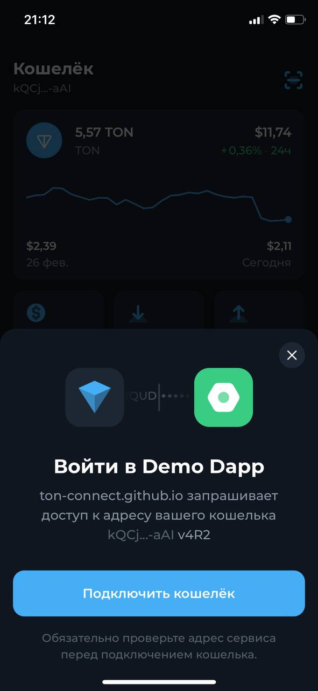
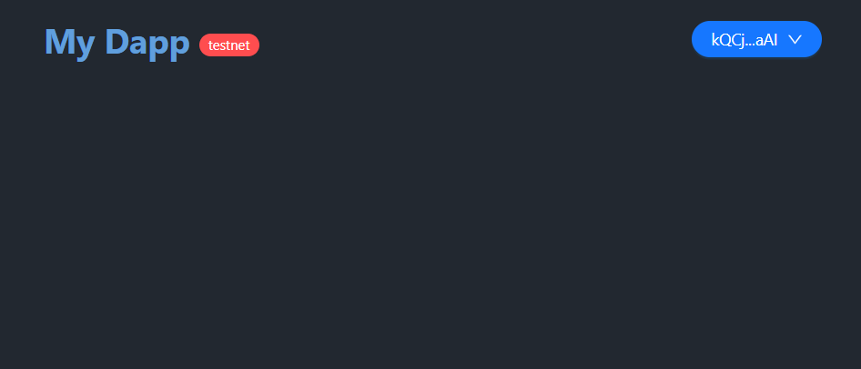
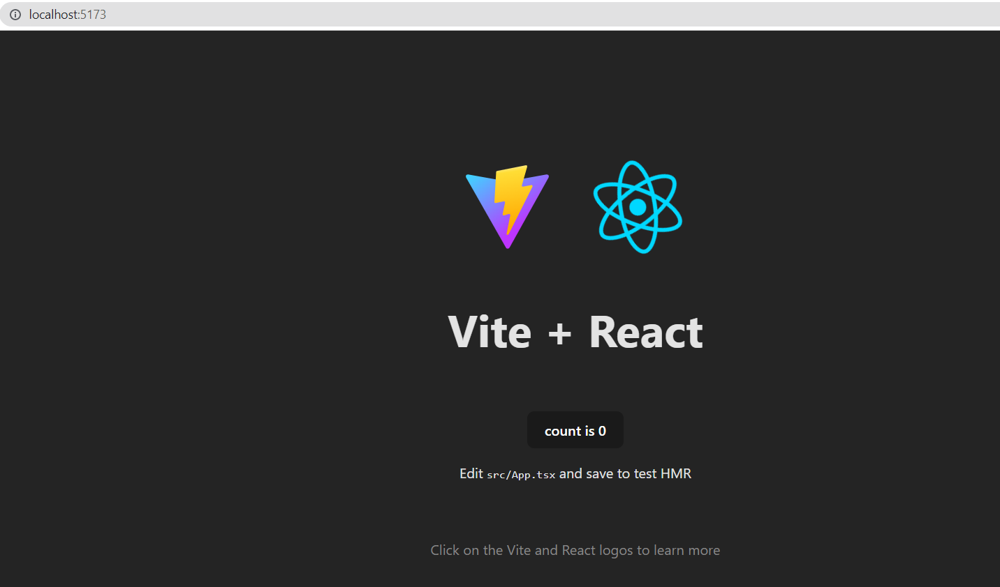

## Вступление

Важной частью децентрализованных приложений является авторизация с помощью крипто кошелька. В данном туториале мы пошагово соберем авторизацию для блокчейна TON с помощью [tonconnect/sdk](https://github.com/ton-connect/sdk).

Задача туториала собрать простое одностраничное приложения(сайт) с кнопкой, реализующей авторизацию с помощью кошелька [Tonkeeper](https://tonkeeper.com/). Для простоты, многие вещи, которые можно улучшить с точки зрения оптимизации кода опущены.

Также мы не будем останавливаться на стилях, так как цель разобрать удобный для будущего расширения под ваши нужды пример.

## Функциональные требования

В нашем примере мы реализуем:
- кнопку авторизации, которая при нажатии будет отдавать QR-код, либо ссылку на авторизацию через Tonkeeper
	- ссылку будет отдавать, когда пользователь заходит в наше приложение с телефона, либо открывает его прямо в браузере внутри кошелька
	- во всех остальных случаях (открытие приложения в Десктопе) будем показывать QR код
- отображение адреса кошелька с которого авторизовался пользователь
- отображение сети (тестовой или основной) в хедере после авторизации
- дисконект кошелька от приложения

Выглядеть это будет так:

1) нажимаем на кнопку авторизации

2) сканируем QR код в приложении и подключаем в кошельке приложение

3) увидим адрес нашего кошелька и метку тестовой сети

Также в туториале мы посмотрим, как можно доставать список разных кошельков интегрированных в [tonconnect/sdk](https://github.com/ton-connect/sdk), чтобы пользователь мог авторизоваться не только с помощью tonkeeper.

## Устаналиваем Vite
Прежде чем начать, в вашей системе должны быть установлены Node и npm. Первый наш шаг — использовать команду `vite` для создания нового приложения. Это можно сделать с помощью команды `npm init` без установки дополнительного программного обеспечения. Откройте терминал в папке по вашему выбору и выполните следующую команду.

	npm init vite@latest vite-tonconnect -- --template react-ts
	
Теперь зайдем в папку

	cd vite-tonconnect

И выполним команду

	 npm install 
	
Протестируем, что мы сделали все правильно:

	npm run dev	
	
Должно увидеть, что-то вроде этого

	 
## Устанавливаем библиотеки

Установим библиотеки необходимые для работы с блокчейном TON:

	npm i ton ton-core ton-crypto

Для авторизации понадобиться библиотека `tonconnect`:
 
	npm i @tonconnect/sdk
	
Чтобы добавить щепотку красоты понадобятся следующие библиотеки:

	npm i antd sass
	
Чтобы авторизоваться с помощью TonConnect, нужно будет использовать Tonkeeper, мы будем сканировать QR код в нашем приложении и подтверждать его в кошельке. Это значит, что нужна библиотека для создания qr кодов:

	npm i react-qr-code

При авторизации, мы столкнемся с необходимостью чтения значений асинхронных селекторов (для получения списка кошельков), поэтому установим библиотеку `recoil`: 

	npm i recoil
	
Если прямо сейчас вызвать библиотеки ton(например преобразовать адрес и вывести его пользователю), то вы увидите ошибку Buffer is not defined. Чтобы обойти эту проблему, установим библиотеку.

	npm i node-stdlib-browser vite-plugin-node-stdlib-browser

И добавим в конфигурационный файл Vite `vite.config.ts` `nodePolyfills()` в плагины.

	import { defineConfig } from 'vite'
	import react from '@vitejs/plugin-react'
	import nodePolyfills from 'vite-plugin-node-stdlib-browser'

	// https://vitejs.dev/config/
	export default defineConfig({
	  plugins: [react(),nodePolyfills()],
	})

## Пишем вспомогательные функции

В соответствии с функциональными требованиями, нам понадобиться вспомогательные функции:
- проверка является ли устройство мобильным
- проверка является ли устройство десктопом
- вспомогательная функция открытия ссылки для редиректа после авторизации

В папке `src` создадим файл `utils.ts` в который добавим функции `isMobile()` и `isDesktop()`. По свойству окна, `innerWidth` будем определять устройство:

	export function isMobile(): boolean {
		return window.innerWidth <= 500;
	}

	export function isDesktop(): boolean {
		return window.innerWidth >= 1050;
	}

Для открытия ссылки воспользуемся методом [open](https://developer.mozilla.org/en-US/docs/Web/API/Window/open) интерфейса `window`:

	export function openLink(href: string, target = '_self') {
		window.open(href, target, 'noreferrer noopener');
	}
	
`noreferrer noopener` - нужены для безопасности, чтобы предотвратить перехват вредными ссылками новой открытой вкладки, так как объект `JavaScript window.opener` позволяет вновь открытой вкладке управлять родительским окном.
 
## Подключаем TonConnect

Первое что надо сделать, это создать подключение, для этого создадим файл в папке `src` `connector.ts`. И сделаем импорт `TonConnect`:

	import { TonConnect } from '@tonconnect/sdk';

Чтобы установить соединение, нужно вызвать `new TonConnect()` и передать туда параметры вашего приложения, когда пользователь будет использовать кошелек для авторизации он увидит данные о вашем приложении и будет понимать куда он подключается. Параметры или по-другому метаданные имеют следующие поля:

	{
	  "url": "<app-url>",                        // required
	  "name": "<app-name>",                      // required
	  "iconUrl": "<app-icon-url>",               // required
	  "termsOfUseUrl": "<terms-of-use-url>",     // optional
	  "privacyPolicyUrl": "<privacy-policy-url>" // optional
	}

Лучшей практикой является размещение манифеста c метаданными в корне вашего приложения, но можно расположить и на гитхабе. Для примера приложу ссылку на гитхаб из репозитория с примером:

	const dappMetadata = {
		manifestUrl:
			'https://gist.githubusercontent.com/siandreev/75f1a2ccf2f3b4e2771f6089aeb06d7f/raw/d4986344010ec7a2d1cc8a2a9baa57de37aaccb8/gistfile1.txt',
	};
	
После формирования метаданных, остается вызвать соединение, получим

	import { TonConnect } from '@tonconnect/sdk';

	const dappMetadata = {
		manifestUrl:
			'https://gist.githubusercontent.com/siandreev/75f1a2ccf2f3b4e2771f6089aeb06d7f/raw/d4986344010ec7a2d1cc8a2a9baa57de37aaccb8/gistfile1.txt',
	};

	export const connector = new TonConnect(dappMetadata);

Если пользователь ранее подключал свой кошелек, коннектор восстановит соединение

Для удобного UX нужно обработать ситуацию, когда пользователь ранее уже подключал кошелек и опять зашел в ваше приложение. Сделаем так, чтобы в такой ситуации сразу восстанавливалось соединение. 

Для этого будем использовать [хук useEffect](https://legacy.reactjs.org/docs/hooks-effect.html), в хуке вызовем `connector.restoreConnection()`. Делать это мы будем в файле `App.tsx`:

	import React, { useEffect } from 'react';
	import reactLogo from './assets/react.svg'
	import viteLogo from '/vite.svg'
	import './App.css'

	import { connector } from '../src/connector';

	function App() {
	  useEffect(() => {
			connector.restoreConnection();
		}, []);

	  return (
		
Auth will be here

	  )
	}

	export default App

> я сразу импортировал стили, на них я не буду останавливаться, так как данный туториал покрывает именно авторизацию

## Создадим кастомные хуки

Для кнопки авторизации будет удобно использовать несколько кастомных хуков. Создадим для них отдельную папку hooks в которой будем четыре скрипта:
- `useTonWallet.ts`
- `useTonWalletConnectionError.ts`
- `useSlicedAddress.ts`
- `useForceUpdate.ts`

Пройдем по каждому из них.

#### useTonWallet

Для работы кнопки авторизации нужно подписаться на изменения статуса соединения, делать это будем с помощью `connector.onStatusChange()`:

	import { Wallet } from '@tonconnect/sdk';
	import { useEffect, useState } from 'react';
	import { connector } from '../connector';

	export function useTonWallet() {
		const [wallet, setWallet] = useState<Wallet | null>(connector.wallet);

		useEffect(() => connector.onStatusChange(setWallet, console.error), []);

		return wallet;
	}

#### useTonWalletConnectionError

Также с помощью `connector.onStatusChange()` обработаем ошибки. Отдельно обработаем ошибку `UserRejectsError` прописанной в `tonconnect/sdk`, она возникает, когда пользователь отклоняет действие в кошельке.

	import { UserRejectsError } from '@tonconnect/sdk';
	import { useCallback, useEffect } from 'react';
	import { connector } from '../connector';

	export function useTonWalletConnectionError(callback: () => void) {
		const errorsHandler = useCallback(
			(error: unknown) => {
				if (typeof error === 'object' && error instanceof UserRejectsError) {
					callback();
				}
			},
			[callback],
		);

		const emptyCallback = useCallback(() => {}, []);

		useEffect(() => connector.onStatusChange(emptyCallback, errorsHandler), [emptyCallback, errorsHandler]);
	}

#### useSlicedAddress

Удобным UX паттерном для кошельков, является отображение адреса кошелька пользователя после авторизации. В TON Connect адреса передаются в `0:<hex>`  формате (raw format), для пользователя был бы удобен так называемый дружелюбный формат, поэтому сделаем обработчик. Подробнее про форматы адресов в TON [здесь](https://docs.ton.org/learn/overviews/addresses).

	import { CHAIN } from '@tonconnect/sdk';
	import { useMemo } from 'react';
	import { Address } from 'ton';

	export function useSlicedAddress(address: string | null | undefined, chain?: CHAIN) {
		return useMemo(() => {
			if (!address) {
				return '';
			}

			const userFriendlyAddress = Address.parseRaw(address).toString({ testOnly: chain === CHAIN.TESTNET });

			return userFriendlyAddress.slice(0, 4) + '...' + userFriendlyAddress.slice(-3);

		}, [address]);
	}

> Отмечу также, что здесь учитывается вариант, что кошелек может находиться в тестовой сети

#### useForceUpdate

В большинстве случаев React сам автоматически обрабатывает компоненты для повторного рендеринга. Причина этого может быть основана на том, когда props'ы или состояние были обновлены. Однако, наш компонент (кнопка авторизации) зависит от третей стороны - пользователь подтверждает действие авторизации в свое кошельке, поэтому нам важно принудительно обновлять компонент, поскольку React может не обнаружить изменения.

	import { useState } from 'react';

	export function useForceUpdate() {
		const [_, setValue] = useState(0);
		return () => setValue((value) => value + 1);
	}

## Достаем список кошельков

Несмотря на то, что в данном примере мы будем использовать только кошелек Tonkeeper в TONConnect можно предлагать пользователю на выбор список кошельков. Для этого их необходимо достать.

Создадим в `src` папку `state` и в ней файл `wallets-list.ts`. Для того, чтобы достать из соединения список кошельков воспользуемся `сonnector.getWallets() `. В данном туториале будем использовать `recoil ` для управления состояниям.

Создадим селектор:

	import { isWalletInfoInjected } from '@tonconnect/sdk';
	import { selector } from 'recoil';
	import { connector } from '../../src/connector';

	export const walletsListQuery = selector({
		key: 'walletsList',
		get: async () => {
			const walletsList = await connector.getWallets();
			
		},
	});

Также в работе с децентрализованными приложениями могут возникнуть ситуации, когда мы открываем предложение в браузере какого-либо кошелька и конечно в таком случае нет смысла предлагать список кошельков, лучше сразу отдать нужный, для подобной ситуации в `tonconnect/sdk` есть `isWalletInfoInjected`, благодаря которому мы сразу сможем достать нужный кошелек:

	import { isWalletInfoInjected } from '@tonconnect/sdk';
	import { selector } from 'recoil';
	import { connector } from '../../src/connector';

	export const walletsListQuery = selector({
		key: 'walletsList',
		get: async () => {
			const walletsList = await connector.getWallets();

			const embeddedWallet = walletsList.filter(isWalletInfoInjected).find((wallet) => wallet.embedded);

			return {
				walletsList,
				embeddedWallet,
			};
		},
	});

## Компонент кнопка авторизации

Наконец-то переходим к самой кнопке авторизации. С импортируем скрипты, которые мы написали до этого, а также не забудем все что, нам нужно для верстки:

	import { DownOutlined } from '@ant-design/icons';
	import { Button, Dropdown, Menu, Modal, notification, Space } from 'antd';
	import React, { useCallback, useEffect, useState } from 'react';
	import QRCode from 'react-qr-code';
	import { useRecoilValueLoadable } from 'recoil';
	import { addReturnStrategy, connector } from '../../../src/connector';
	import { useForceUpdate } from '../../../src/hooks/useForceUpdate';
	import { useSlicedAddress } from '../../../src/hooks/useSlicedAddress';
	import { useTonWallet } from '../../../src/hooks/useTonWallet';
	import { useTonWalletConnectionError } from '../../../src/hooks/useTonWalletConnectionError';
	import { walletsListQuery } from '../../../src/state/wallets-list';
	import { isDesktop, isMobile, openLink } from '../../../src/utils';
	import './style.scss';

Вы могли заметить, что в предыдущих шагах нигде не упоминалось отключение кошелька от приложения(дисконнект). По логике нашего примера, после авторизации пользователю показывается адрес подключенного кошелька, при нажатии на кнопку появиться выпадающее меню с опцией. Сделаем это с помощью `Menu` из бибилиотеки `antd`.

	const menu = (
		<Menu
			onClick={() => connector.disconnect()}
			items={[
				{
					label: 'Disconnect',
					key: '1',
				},
			]}
		/>
	);

Пришло время самого компонента, по сути авторизация — это просто получение ссылки авторизации и отображение её пользователю (либо ссылкой, либо QR-кодом), поэтому наш самый главный хук — это обработка ссылки:

	export function AuthButton() {
		const [modalUniversalLink, setModalUniversalLink] = useState('');

		return (
			<>
				

				

			</>
		);
	}

Данный хук позволит устанавливать значение ссылки авторизации. Если пользователь не авторизован ему надо отобразить кнопку с запускающую процесс авторизации, если авторизован отобразить кнопку-адрес, которая позволит отключить кошелек. Для этого надо понимать подключен ли кошелек, в этом нам поможет хук, который мы написали до этого `useTonWallet()`. Так важно вспомнить, что наш компонент получает информацию об изменении от третьей стороны, что значит необходимо принудительно обновлять компонент: 

	export function AuthButton() {
		const [modalUniversalLink, setModalUniversalLink] = useState('');
		const forceUpdate = useForceUpdate();
		const wallet = useTonWallet();
		
		return (
			<>
				

					{wallet ? (
					<Dropdown overlay={menu}>
						<Button shape="round" type="primary">
							<Space>
								{address}
								<DownOutlined />
							</Space>
						</Button>
					</Dropdown>
				) : (
					<Button shape="round" type="primary" onClick={handleButtonClick}>
						Connect Wallet
					</Button>
				)}
				

			</>
		);
	}

Здесь же обработаем ошибки и достанем список кошельков, а также сразу же преобразуем адрес:

	export function AuthButton() {
		const [modalUniversalLink, setModalUniversalLink] = useState('');
		const forceUpdate = useForceUpdate();
		const wallet = useTonWallet();
		const onConnectErrorCallback = useCallback(() => {
			setModalUniversalLink('');
			notification.error({
				message: 'Connection was rejected',
				description: 'Please approve connection to the dApp in your wallet.',
			});
		}, []);
		useTonWalletConnectionError(onConnectErrorCallback);

		const walletsList = useRecoilValueLoadable(walletsListQuery);

		const address = useSlicedAddress(wallet?.account.address, wallet?.account.chain);

		return (
			<>
				

					{wallet ? (
						<Dropdown overlay={menu}>
							<Button shape="round" type="primary">
								<Space>
									{"hi"}
									<DownOutlined />
								</Space>
							</Button>
						</Dropdown>
					) : (
						<Button shape="round" type="primary" onClick={handleButtonClick}>
							Connect Wallet
						</Button>
					)}
				

			</>
		);
	}

Обработаем нажатие клавиши, первое что проверим, под грузился ли список кошельков, если нет, подождем:

		const handleButtonClick = useCallback(async () => {
			
			if (!(walletsList.state === 'hasValue')) {
				setTimeout(handleButtonClick, 200);
			}

		}, [walletsList]);

При получении списка кошельков мы проверяли случай, когда мы открываем приложение внутри кошелька, пришло время воспользоваться данной переменной. Если это не десктоп и приложение открыто внутри кошелька, воспользуемся именно этим кошельком для подключения:

	const handleButtonClick = useCallback(async () => {
		if (!(walletsList.state === 'hasValue')) {
			setTimeout(handleButtonClick, 200);
		}

		if (!isDesktop() && walletsList.contents.embeddedWallet) {
			connector.connect({ jsBridgeKey: walletsList.contents.embeddedWallet.jsBridgeKey });
			return;
		}

	}, [walletsList]);

Пришло время получать ту самую ссылку для авторизации, из списка кошельков возьмем первый - это Tonkeeper и достанем ссылку используя `connector.connect()`:

	const handleButtonClick = useCallback(async () => {
		if (!(walletsList.state === 'hasValue')) {
			setTimeout(handleButtonClick, 200);
		}

		if (!isDesktop() && walletsList.contents.embeddedWallet) {
			connector.connect({ jsBridgeKey: walletsList.contents.embeddedWallet.jsBridgeKey });
			return;
		}

		const tonkeeperConnectionSource = {
			universalLink: walletsList.contents.walletsList[0].universalLink,
			bridgeUrl: walletsList.contents.walletsList[0].bridgeUrl,
		};

		const universalLink = connector.connect(tonkeeperConnectionSource);

	}, [walletsList]);

Теперь осталось разобраться с мобильными устройствами, предлагать QR код не удобно, поэтому будем сразу кидать ссылку, в остальных случаях будем передавать ссылку для авторизации под QR код. В этом нам поможет вспомогательная функция, которую мы писали ранее:

		const handleButtonClick = useCallback(async () => {
			// Use loading screen/UI instead (while wallets list is loading)
			if (!(walletsList.state === 'hasValue')) {
				setTimeout(handleButtonClick, 200);
			}

			if (!isDesktop() && walletsList.contents.embeddedWallet) {
				connector.connect({ jsBridgeKey: walletsList.contents.embeddedWallet.jsBridgeKey });
				return;
			}

			const tonkeeperConnectionSource = {
				universalLink: walletsList.contents.walletsList[0].universalLink,
				bridgeUrl: walletsList.contents.walletsList[0].bridgeUrl,
			};

			const universalLink = connector.connect(tonkeeperConnectionSource);

			if (isMobile()) {
				openLink(addReturnStrategy(universalLink, 'none'), '_blank');
			} else {
				setModalUniversalLink(universalLink);
			}
		}, [walletsList]);

Осталось добавить модалку и вот итоговый компонент `AuthButton.tsx`:

	import { DownOutlined } from '@ant-design/icons';
	import { Button, Dropdown, Menu, Modal, notification, Space } from 'antd';
	import React, { useCallback, useEffect, useState } from 'react';
	import QRCode from 'react-qr-code';
	import { useRecoilValueLoadable } from 'recoil';
	import { addReturnStrategy, connector } from '../../../src/connector';
	import { useForceUpdate } from '../../../src/hooks/useForceUpdate';
	import { useSlicedAddress } from '../../../src/hooks/useSlicedAddress';
	import { useTonWallet } from '../../../src/hooks/useTonWallet';
	import { useTonWalletConnectionError } from '../../../src/hooks/useTonWalletConnectionError';
	import { walletsListQuery } from '../../../src/state/wallets-list';
	import { isDesktop, isMobile, openLink } from '../../../src/utils';
	import './style.scss';

	const menu = (
		<Menu
			onClick={() => connector.disconnect()}
			items={[
				{
					label: 'Disconnect',
					key: '1',
				},
			]}
		/>
	);

	export function AuthButton() {
		const [modalUniversalLink, setModalUniversalLink] = useState('');
		const forceUpdate = useForceUpdate();
		const wallet = useTonWallet();
		const onConnectErrorCallback = useCallback(() => {
			setModalUniversalLink('');
			notification.error({
				message: 'Connection was rejected',
				description: 'Please approve connection to the dApp in your wallet.',
			});
		}, []);
		useTonWalletConnectionError(onConnectErrorCallback);

		const walletsList = useRecoilValueLoadable(walletsListQuery);

		const address = useSlicedAddress(wallet?.account.address, wallet?.account.chain);

		useEffect(() => {
			if (modalUniversalLink && wallet) {
				setModalUniversalLink('');
			}
		}, [modalUniversalLink, wallet]);

		const handleButtonClick = useCallback(async () => {
			if (!(walletsList.state === 'hasValue')) {
				setTimeout(handleButtonClick, 200);
			}

			if (!isDesktop() && walletsList.contents.embeddedWallet) {
				connector.connect({ jsBridgeKey: walletsList.contents.embeddedWallet.jsBridgeKey });
				return;
			}

			const tonkeeperConnectionSource = {
				universalLink: walletsList.contents.walletsList[0].universalLink,
				bridgeUrl: walletsList.contents.walletsList[0].bridgeUrl,
			};

			const universalLink = connector.connect(tonkeeperConnectionSource);

			if (isMobile()) {
				openLink(addReturnStrategy(universalLink, 'none'), '_blank');
			} else {
				setModalUniversalLink(universalLink);
			}
		}, [walletsList]);

		return (
			<>
				

					{wallet ? (
						<Dropdown overlay={menu}>
							<Button shape="round" type="primary">
								<Space>
									{address}
									<DownOutlined />
								</Space>
							</Button>
						</Dropdown>
					) : (
						<Button shape="round" type="primary" onClick={handleButtonClick}>
							Connect Wallet
						</Button>
					)}
				

				<Modal
					title="Connect to Tonkeeper"
					open={!!modalUniversalLink}
					onOk={() => setModalUniversalLink('')}
					onCancel={() => setModalUniversalLink('')}
				>
					<QRCode
						size={256}
						style={{ height: '260px', maxWidth: '100%', width: '100%' }}
						value={modalUniversalLink}
						viewBox={`0 0 256 256`}
					/>
				</Modal>
			</>
		);
	}

## Компонент хедер приложения

Для удобства работы с децентрализованный приложениями важно отображать в какой сети тестовой или основной происходит действие. Выведем пользователю в какой сети кошелек, который он использовал для авторизации рядом с названием приложения. Для этого создадим отдельный компонент `AppTitle.tsx`. 

	import { CHAIN } from '@tonconnect/sdk';
	import React, { useEffect, useRef, useState } from 'react';
	import { useTonWallet } from '../../../src/hooks/useTonWallet';
	import './style.scss';

	const chainNames = {
		[CHAIN.MAINNET]: 'mainnet',
		[CHAIN.TESTNET]: 'testnet',
	};

	export function AppTitle() {
		const wallet = useTonWallet();

		return (
			<>
				

					My Dapp
					{wallet && {chainNames[wallet.account.chain]}}
				

			</>
		);
	}

Как можно видеть, здесь все просто используем наш хук для получения текущего кошелька из кошелька получаем номер сети и по справочнику `CHAIN ` зашитому в  `tonconnect/sdk ` получим сеть.

## Добавим наши компоненты на страницу

В файле App.tsx добавим написанные нами компоненты в хедер:

	import React, { useEffect } from 'react';
	import { AppTitle } from '../src/components/AppTitle/AppTitle';
	import { AuthButton } from '../src/components/AuthButton/AuthButton';
	import { connector } from '../src/connector';
	import 'antd/dist/reset.css';
	import './app.scss';

	function App() {
	  useEffect(() => {
			connector.restoreConnection();
		}, []);

	  return (
		

		  <header>
			<AppTitle />
			<AuthButton />
		  </header>
		  <main>
		  </main>
		
    
	  )
	}

	export default App

Также важно в файле `main.tsx` обернуть в `RecoilRoot` приложение так как мы используем селекторы.

	import React from 'react'
	import ReactDOM from 'react-dom/client'
	import App from './App'
	import './index.scss';
	import { RecoilRoot } from 'recoil';

	ReactDOM.createRoot(document.getElementById('root') as HTMLElement).render(
	  <RecoilRoot>
	  	<React.StrictMode>
			<App />
	  	</React.StrictMode>
	  </RecoilRoot>,
	)

И на это всё. Во второй части мы разберем как отправлять транзакции с помощью подключенного кошелька и расширим наш пример.

## Заключение 

Пример есть на гитхаб. Подобные статья публикую [сюда](https://t.me/ton_learn). Спасибо за внимание.

